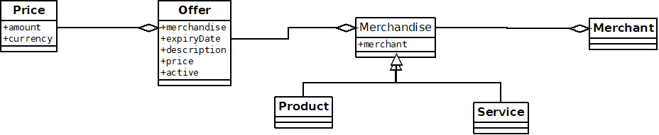

# offer-service

## Domain Design

See the below diagram to see how the domain has been modelled

## API methods
* PUT /merchandise/{merchandiseId}/offer
* GET /merchandise/{merchandiseId}/offer/{offerId}
* DELETE /merchandise/{merchandiseId}/offer/{offerId}

## Assumptions made

* "Merchandise" is the generalised term used here to describe a product or service
* Merchandise may have more than one offer associated with it, so should allow the user to create multiple offers for the same merchandise.
* User of the APIs already has the merchandise ID (product or service ID) for which they want to create an offer for.
* Offers which are not currently active will not be returned when fetching them again (404 Not Found).
* Offers which have expired will return an appropriate HTTP error response (410 Gone)
* Cancelling an offer does not remove that offer from the Database, it just marks as inactive
* Creating an offer will return the offer ID which was created. This can then be used for further querying.
* There is validation of the fields on the create endpoint which will return a HTTP 422 with an error response body with the list of field failures in the request

## Testing the API (Rest client)

Some data has been pre-loaded into the in-memory Database on application start.
There is currently only 1 merchant (seller), and 1 merchandise (product) in the Database.

To test the API's using a REST client (Postman or CURL), use the following URL's with a header of `application/json` when using PUT:

For GET and DELETE: <http://localhost:8080/merchandise/f1cad633-863d-443c-a494-c993fdee8d4f/offer/b32c7b98-83f4-4733-a751-aeb069c2320c>
For PUT: <http://localhost:8080/merchandise/f1cad633-863d-443c-a494-c993fdee8d4f/offer>

With the PUT request, some content will need to be sent to the server. Use the following JSON structure (modify as you wish):
`
{
    "expiryDate": "2019-01-01",
    "description": "Product 1",
    "currencyCode": "GBP",
    "priceAmount": 20
}
`

## Testing the project (all unit/integration/service tests)

This project is packaged using Maven, so from the command line you can simply run:
`mvn clean test`

## Starting the application

This is a Spring Boot application, and so you can either run the main application class (`Application.java`) directly from the IDE or run it in Maven using `mvn spring-boot:run`

## Technologies used

This project using Spring Boot deployed in an embedded tomcat servlet container. It uses Spring Web for the web layer and Spring Data JPA for persisting the data into an in-memory H2 database.